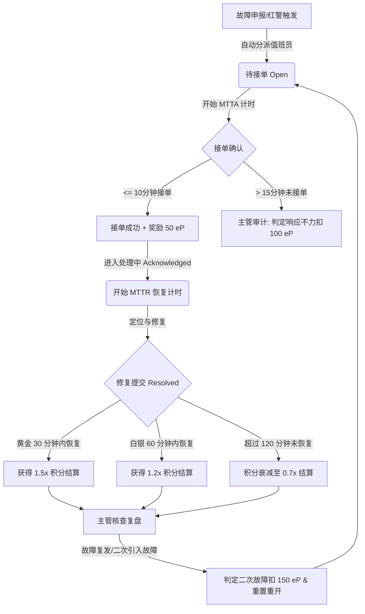

# 🛡️ ePoints 效能协同与保障管理系统

[](#)
[](#)
[](#)

## 📖 项目背景与愿景

本项目灵感源于**俄乌战争中乌克兰国防构建的 epoints 军事协同系统**。该系统将战斗任务、装备供给与后勤保障高度整合，通过即时激励和透明的指挥看板，极大地提升了前线军事行动的灵活性与协同效率。

我们参考了其核心理念，去军事化并转化为适用于**国内企业的“人员效能与保障管理系统”**。系统重点解决以下企业痛点：
1. **任务激励滞后**：将传统的季度/年度 KPI 考核转变为基于**即时积分（eP）**的精细化敏捷回报，激发全员自驱力。
2. **战略调整缓慢**：管理层通过**动态战略倍率**实时调控任务优先级，引导多部门合力攻坚。
3. **售后保障脱节**：引入**On-Call 值班、一键 SOS 红警及 SLA 极速响应机制**。系统出问题时，能以最快的速度定位值班人员、一键发出全员红警通报，并按解决时间分级核发积分，用机制保障服务可用性。

---

## 🚀 核心系统模块

系统提供五大核心协作舱，实现了从任务领取、保障响应到福利兑换的闭环：

### 📊 1. 指挥中心 (Dashboard)
- **个人效能面板**：展示当前账号可用 eP 余额、累计获得总 eP 及自动换算结算的 **L1-L5 荣誉段位**。
- **权限演练中心**：支持在 **项目总监 (张建国)**、**资深研发 (李明)**、**开发工程师 (王芳)**、**UI/UX设计 (赵勇)**、**QA测试 (刘洋)** 之间快速切号，体验不同角色的权限视角。
- **研发效能贡献榜**：根据历史累计获得积分实时滚动展示全员排行，并自动标记本期 MVP。
- **实时动态屏**：即时广播任务提审、故障修复、商城兑换等流水，确保信息高度透明。
- **规则白皮书**：卡片式手册，可切换查看多部门积分标准与段位晋升细则。

### ⚙️ 2. 项目任务板 (Mission Board)
- **卡片式看板**：展示公司当前开放的全部战术任务。
- **动态倍率**：醒目标记由项目总监配置的战略调节倍率（例如 $1.0\times$ 标准、$1.5\times$ 加急，或 $2.0\times$ 攻坚）。
- **认领与提审**：工程师可一键认领开发、设计、测试任务。在完成后，需上传**“成果证明 URL 或 Git Commit Hash”**提请总监审核。

### 🛒 3. 能量福利商城 (Reward Market)
- **16款精选福利**：精细划分 Lifestyle (生活)、Hardware (硬件)、Software (软件)、Training (培训) 四大品类。
- **分级兑换机制**：与荣誉等级深度契合，涵盖了从几百积分的“咖啡下午茶”到上千积分的“机械键盘/降噪耳机”，直至 L5 顶级殿堂级的“定制海外游赞助基金”与“顶配免折旧 MacBook Pro 终身个人所有权”。
- **扣减与流水**：系统自动完成起兑等级拦截、库存扣减、积分抵扣并生成日志。

### 🛡️ 4. 技术保障中心 (Support Center)
- **On-Call 值班表**：展示今日核心系统在岗技术负责人与联系方式。
- **一键 SOS 红警警报**：当生产环境或客户售后出现重大故障时，任何员工均可按下“**一键报警**”按钮，生成高优排障工单。
- **全屏暗红脉冲预警**：一旦系统中存在未解决的 **Critical (紧急)** 工单，**整个系统外壳将瞬间触发全屏红警光晕与脉冲呼吸动画**，营造极度紧张的“战时”抢修氛围，直至问题被接单并彻底解决。
- **SLA 倒计时计时器**：实时倒计时，配合 **1.8x / 1.4x 极速修复时效加成积分**，用数据驱动黄金响应。

### 🎛️ 5. 控制台 (Admin Console)
- *（仅限项目总监“张建国”可用）*
- **任务规划**：快速新建任务，划拨基础积分与配置战略倍率。
- **提审成果审核**：双联审核看板，可一键批准或驳回员工提交的交付成果，并自动拨付积分。
- **SLA 故障指派**：派单、挂单及审查应急修复时效，结算 SLA 最终收益。

---

## 🛠️ 技术栈与特性

- **前端核心**：React (v19) + Vite (v8) + Vanilla CSS。
- **图标系统**：Lucide React。
- **样式美学**：现代高保真磨砂玻璃微拟物风格 (Glassmorphism)，配合暗黑科技冷色调（HSL 主题色变量），打造极客质感。
- **红警警报视效**：使用 CSS `@keyframes` 实现全屏暗红色的背景脉冲呼吸动画，深度震撼视觉。
- **数据层**：`mockData.js` 提供完整的内存数据库状态机，自动读写 LocalStorage，支持跨页面响应式数据流通。
- **缓存自动迁移**：内置静默数据检测。如果检测到浏览器中缓存有乌克兰语境的旧版人名或失效的 Unsplash 外部图片，系统在加载时会自动执行 LocalStorage 数据擦除与平滑重建。

---

## 📦 本地运行指南

### 1. 克隆/打开目录
确保本地拥有 Node.js 运行环境。打开项目根目录：
```bash
d:\epoints
```

### 2. 安装依赖
```bash
npm install
```

### 3. 启动本地开发服务
启动 Vite 后台开发服务器，支持 HMR 热重载：
```bash
npm run dev
```
运行成功后，在浏览器中打开：👉 **[http://localhost:5173/](http://localhost:5173/)**

### 4. 生产环境构建与打包
运行以下命令以检验代码编译正确性或生成静态包：
```bash
npm run build
```
编译产物将保存在 `dist/` 文件夹中。

---

## 📜 ePoints 核心规则概览

### 1. 积分与战线类别
- **产品战线 (PM)**：PRD 规划 (800-1500 eP)、竞品分析 (500-800 eP)。
- **研发战线 (Dev)**：架构调优 (1200-2000 eP)、模块开发 (600-1100 eP)、Bug 修复 (150-400 eP)。
- **体验设计 (UX/UI)**：UI 规范 (1500-2500 eP)、高保真方案 (500-1000 eP)。
- **质量与安全 (QA/SEC)**：自动化框架 (1000-1800 eP)、渗透审计 (800-1200 eP)。
- **系统保障与运维 (OPS)**：多机房容灾 (1500-3000 eP)、SLA 紧急故障 (300 eP 基准 + 时效奖励)。
- **市场与大客户成功 (BD)**：大客户成功签约 (2000-5000 eP)。
- **带教与组织建设 (HR)**：通过试用期带教 (1000 eP/人)。

### 2. 荣誉头衔体系
- **L1 研发新星 / 业务助理**：`0 - 1,999 eP` （生活茶歇兑换）
- **L2 开发骨干 / 交付先锋**：`2,000 - 4,999 eP` （数码办公外设）
- **L3 核心专家 / 业务操盘手**：`5,000 - 9,999 eP` （带薪调休假，考勤对接）
- **L4 效能大师 / 战略指挥官**：`10,000 - 19,999 eP` （稀缺办公生产力）
- **L5 终身荣誉殿堂**：`20,000+ eP` （免折旧顶配 MacBook 终身归属，海外自由行）

### 3. 问责与处罚条例
为了保证任务申报与系统应急维护的严肃性，系统引入扣减 eP 积分的负向激励机制：
- **故障处理严重超时 (SLA Breached)**: P0/P1故障 (Critical) 超过 120 分钟未恢复，扣减责任人 `100 - 200 eP` 效能积分。
- **值班响应不力 (On-Call Negligence)**: 接警警报后 15 分钟内未开始响应或推诿接单，扣减当前值班员 `100 eP`。
- **修复质量低下 (Secondary Incident)**: 标记 Resolved 后 2 小时内故障由于相同根因重发，扣除原修复人 `150 eP`。
- **虚报成果灌水 (False Reporting)**: 虚构或应付提交任务成果，被主管驳回且判定为灌水，扣减当事人 `50 eP`。

---

## 🛡️ 技术保障中心（SLA 双轨制）整体作业流程

技术保障中心遵循业界标准的 **SLA（服务等级协议）双轨制响应与恢复模型**，对线上突发故障建立端到端的闭环管控：



### 1. 警报触发与初始分派阶段
- 当客服或员工发现系统异常，在**“技术保障中心”**填写申报单。
- 若故障等级设为 **Critical (红色警戒)**，主系统将全屏闪烁暗红色脉冲背景，顶部弹出全局警报。
- 工单初始化为 `Open` (待接单) 状态，并自动指派给当天在岗的 **On-Call 值班工程师**。**MTTA（Mean Time to Acknowledge，平均响应时间）** 计时即刻启动。

### 2. 确认接单与响应保障阶段 (SLA MTTA)
- 值班工程师在故障排除队列中看到待接单卡片，点击 **“确认接单响应，开始排障”**。
- 工单状态更新为 `Acknowledged` (处理中)，MTTA 计时停止：
  - **黄金 10 分钟内接单**：系统自动给值班员发放 `+50 eP` 极速接单额外奖励。
  - **超时未响应（超过 15 分钟）**：项目总监可在工单下方点击 **“判定接单响应不力”**，对该值班员直接罚扣 `100 eP` 效能积分并进行系统警告。

### 3. 定位修复与系统恢复阶段 (SLA MTTR)
- 接单后，值班工程师全力排查并修复系统故障。**MTTR（Mean Time to Resolve，平均恢复时间）** 计时启动（从接单时刻至排除时刻）。
- 故障排除后，工程师点击 **“我已解决此故障，申请结算排障积分”**，填写排障方案报告。
- 工单状态更新为 `Resolved` (已排除)，MTTR 计时停止。系统依据恢复时长动态结算积分倍率：
  - **黄金 30 分钟内恢复**：奖励 **1.5x** 积分（如 Critical 故障结算 450 eP）。
  - **白银 60 分钟内恢复**：奖励 **1.2x** 积分（结算 360 eP）。
  - **超时恢复（大于 120 分钟）**：扣减扣罚倍率至 **0.7x** 积分结算（仅得 210 eP）。

### 4. 效能审计与返工问责阶段
- 故障排除后，主管将进行后期复盘核查。
- 若发现值班工程师提交的修复方案质量低下（如只是随手重启，导致 2 小时内故障因同样原因再次爆发或引起次生严重 Bug），主管可点击 **“判定二次故障/返工并追责”**：
  - **追责扣分**：对原修复人处以 `150 eP` 积分重罚。
  - **工单重开**：清除原接单与修复时间记录，工单状态重新回滚为 `Open` (待接单) 并重新拉起红色警报，要求值班员重新排障。
