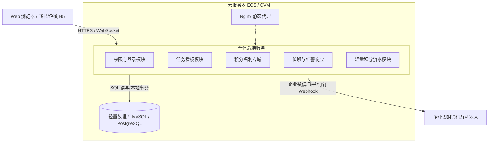

# 🛡️ ePoints 敏捷协同系统 - 轻量化企业架构蓝图 (50人团队专属)

针对 **50 人以内的敏捷团队**，架构设计的第一优先级是**极低的运维成本、一键式部署、极高的开发效率**。

为此，我们放弃了复杂的微服务、分布式消息队列（Kafka）、容器编排（K8s）等高成本方案，选用**“单体全栈 + 关系型数据库”**的经典敏捷架构。这套架构在一台普通的 **1核2G/2核4G 云服务器**上即可流畅运行，每月服务器成本低于百元。

---

## 🏛️ 1. 总体架构设计 (单体分层)

采用单体后端架构，前端打包为静态文件由后端直接托管或由 Nginx 代理，结构极其简单：



---

## 🛠️ 2. 极简技术栈选型

| 架构分层 | 技术选型 | 选用理由 (以极简为导向) |
| :--- | :--- | :--- |
| **前端开发** | React + Lucide Icons + CSS | 继承演示原型代码，开发速度最快。 |
| **后端语言** | **Spring Boot (Java)** 或 **NestJS / Express (Node.js)** | 单体框架。如果团队熟悉 JS，直接用 NestJS，前后端同语言，维护成本极低。 |
| **核心数据库**| **PostgreSQL** 或 **MySQL 8.0** | 单机关系型数据库。50人团队的数据量仅需单表，单机完全能扛起每秒数千次查询。 |
| **缓存机制** | **Caffeine (本地内存缓存)** | 数据库有索引，50 人排行榜直接在 SQL 中排序只需几毫秒。无需安装部署 Redis。 |
| **即时通讯** | 浏览器原生 **WebSocket** / **SSE** | 后端单体服务直接开辟 WebSocket 端口进行警报广播，无任何中间件依赖。 |
| **消息广播** | Spring Event / Node EventEmitter | 业务解耦（如提审通知、兑换扣减）直接使用进程内的事件广播，无需部署 RabbitMQ。 |
| **部署与运维**| **Docker Compose** | 编写一个 Docker 配置文件，一键拉起前端、后端和数据库，小白也能轻松发布。 |

---

## 💾 3. 数据与积分流水设计 (简单且安全)

为了保证积分发放不乱账，同时保持数据库架构的极致简单，我们设计了**“积分流水表 + 账户余额”**的双重保险：

### 3.1 核心数据库表设计

#### 用户余额表 (`users`)
```sql
CREATE TABLE `users` (
  `id` VARCHAR(32) PRIMARY KEY,
  `name` VARCHAR(32) NOT NULL,
  `avatar` VARCHAR(255),
  `role` VARCHAR(32) NOT NULL,
  `role_type` VARCHAR(16) NOT NULL COMMENT 'Admin/Engineer/Designer等',
  `points_balance` INT DEFAULT 0 COMMENT '可用积分余额',
  `points_earned_lifetime` INT DEFAULT 0 COMMENT '累计获得总积分 (用于计算段位)',
  `penalties_count` INT DEFAULT 0 COMMENT '累计受罚次数',
  `points_deducted_total` INT DEFAULT 0 COMMENT '累计罚扣积分'
);
```

#### 积分变动记录表 (`point_logs`)
积分增加、消耗、处罚扣减的每一次变动均写入此流水。
```sql
CREATE TABLE `point_logs` (
  `log_id` INT AUTO_INCREMENT PRIMARY KEY,
  `user_id` VARCHAR(32) NOT NULL,
  `action_type` VARCHAR(32) NOT NULL COMMENT 'REWARD_BUY(购买商品), MISSION_EARN(完成任务), PENALTY(处罚扣减), SLA_AWARD(排障时效奖励)',
  `points_change` INT NOT NULL COMMENT '积分变动值 (如增加为 +200, 扣减为 -50)',
  `description` VARCHAR(255) NOT NULL COMMENT '描述原因(例如: 判定虚报成果驳回)',
  `operator_id` VARCHAR(32) NOT NULL COMMENT '操作人ID (系统或张建国)',
  `created_at` TIMESTAMP DEFAULT CURRENT_TIMESTAMP,
  INDEX idx_user_id (`user_id`)
);
```

> [!TIP]
> **本地事务保障防刷**：在后端对涉及积分的操作使用 `@Transactional` (或对应数据库事务)，先扣减/增加 `users.points_balance`，紧接着插入一条 `point_logs` 记录。如果任意一步失败，事务自动回滚，确保绝对不会错账。

---

## 🚨 4. SLA 应急保障与群机器人打通

50人团队无需复杂昂贵的 OpsGenie 或 PagerDuty。利用企业日常使用的**即时通讯软件（飞书/企业微信/钉钉）群机器人 Webhook** 即可实现高效报警：

```
[系统故障 Critical 上报]
       │
       ├─► 1. 进程内 WebSocket 向全网页实时广播 (系统变为红警界面)
       │
       └─► 2. 后端直接发起 HTTP POST 请求发送至企业通讯软件 Webhook 地址
```

### 飞书/企微 Webhook 发送代码示例（以 Node.js 为例）
```javascript
async function sendToGroupChat(ticketTitle, assigneeName, severity) {
  const webhookUrl = "https://open.feishu.cn/open-apis/bot/v2/hook/xxx"; // 替换为飞书群机器人链接
  const payload = {
    "msg_type": "post",
    "content": {
      "post": {
        "zh_cn": {
          "title": `🚨 系统发生紧急故障 (SLA ${severity} 级别)`,
          "content": [
            [{ "tag": "text", "text": `故障描述: ${ticketTitle}\n` }],
            [{ "tag": "text", "text": `当前指派值班员: ${assigneeName}\n` }],
            [{ "tag": "text", "text": "响应时效: 请值班员在 10 分钟内点击页面 [接单响应] 以免超时扣分！" }]
          ]
        }
      }
    }
  };
  
  await fetch(webhookUrl, {
    method: 'POST',
    headers: { 'Content-Type': 'application/json' },
    body: JSON.stringify(payload)
  });
}
```

---

## 📦 5. 极速发布与部署规划

对于 50 人团队，无需搭建复杂的 K8s 集群。推荐在一台单机云服务器上使用 **Docker Compose** 进行容器化一键部署：

### 5.1 Docker Compose 配置文件示例 (`docker-compose.yml`)
```yaml
version: '3.8'

services:
  # 数据库服务
  db:
    image: mysql:8.0
    container_name: epoints-db
    restart: always
    environment:
      MYSQL_DATABASE: epoints
      MYSQL_ROOT_PASSWORD: my-secret-pw
    ports:
      - "3306:3306"
    volumes:
      - db-data:/var/lib/mysql

  # 全栈单体服务 (内含前端静态文件与后端 API)
  app:
    image: epoints-app:latest
    container_name: epoints-app
    restart: always
    ports:
      - "80:8080" # 将内网 8080 端口映射到公网 80 端口
    environment:
      DB_HOST: db
      DB_USER: root
      DB_PASSWORD: my-secret-pw
    depends_on:
      - db

volumes:
  db-data:
```

### 5.2 部署步骤
1. 在云服务器上安装 Docker。
2. 将代码包与 `docker-compose.yml` 上传至服务器。
3. 运行一键启动命令：
   ```bash
   docker-compose up -d
   ```
4. 系统即可上线运行。后续代码更新只需重新 build 镜像并重启即可。
